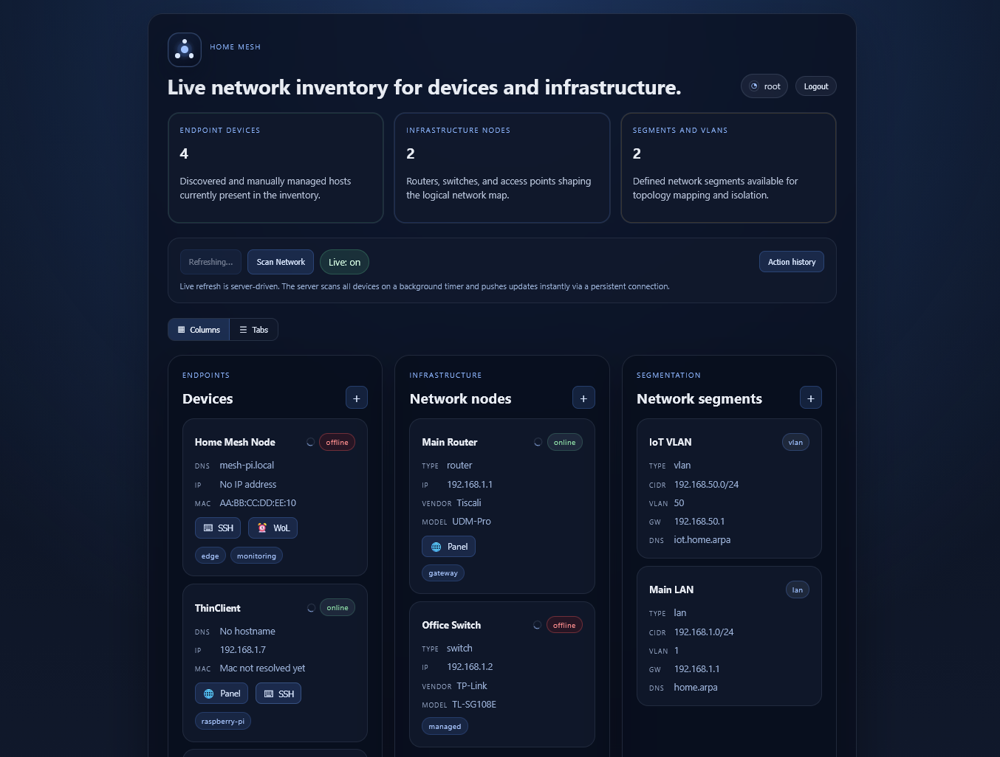

# Home Mesh



Home Mesh is a local-first network inventory and control panel for home labs and small networks.

It is designed to discover, map, and manage:

- endpoint devices
- network infrastructure such as routers, switches, and access points
- logical network segments such as LANs and VLANs
- operational actions such as Wake-on-LAN and SSH access

The goal is to provide a lightweight control surface that can manage heterogeneous devices and infrastructure, while being able to run on a thin client, Raspberry Pi, mini PC, or another always-on node near the network edge.

## What It Does

Current MVP capabilities include:

- support for heterogeneous managed targets, not just one class of device
- inventory CRUD for devices, network nodes, and network segments
- topology relations and a visual topology graph
- global live refresh for device and network-node status
- sequential browser-driven auto-refresh without overlapping cycles
- progressive per-item refresh updates in the UI
- DNS-to-IP refresh when a hostname is configured
- best-effort MAC address resolution
- manual MAC address entry for devices
- Wake-on-LAN for devices with a known MAC address
- encrypted per-device SSH credential storage
- interactive SSH terminal in the web UI
- action history for operational events
- application authentication with backend-protected APIs
- Docker-based local deployment

## Architecture

The project is split into two main parts:

- Go backend
  - REST API
  - SQLite persistence
  - refresh/probing logic
  - Wake-on-LAN
  - encrypted secrets
  - SSH execution and terminal sessions
- React + TypeScript frontend
  - inventory dashboard
  - topology graph
  - CRUD popups
  - SSH modal and terminal UI

## Repository Structure

- `cmd/server`
  - backend entrypoint
- `internal/actions`
  - operational actions such as Wake-on-LAN
- `internal/api`
  - HTTP routing and API handlers
- `internal/config`
  - environment-based configuration
- `internal/monitor`
  - live refresh and reachability checks
- `internal/secrets`
  - encryption/decryption for stored secrets
- `internal/sshclient`
  - SSH command and terminal session logic
- `internal/store`
  - SQLite schema and persistence layer
- `web`
  - React + TypeScript frontend

## Tech Stack

- Go
- React
- TypeScript
- Vite
- SQLite
- Docker Compose
- Nginx for frontend container serving/proxying

## Local Development

### Prerequisites

- Go 1.22+
- Node.js 20+
- npm 10+
- Docker Desktop or Docker Engine

### Environment

Create a local `.env` from `.env.example`.

Required values:

- `HOME_MESH_MASTER_KEY`
- `HOME_MESH_SESSION_SECRET`
- `HOME_MESH_BOOTSTRAP_ADMIN_PASSWORD`
- optionally `HOME_MESH_SSH_HOST_KEY_MODE`
- optionally `HOME_MESH_NMAP_PATH`
- optionally `HOME_MESH_WEB_PORT`

Example:

```dotenv
HOME_MESH_MASTER_KEY=replace-with-a-base64-encoded-32-byte-key
HOME_MESH_SESSION_SECRET=replace-with-a-long-random-session-secret
HOME_MESH_BOOTSTRAP_ADMIN_USERNAME=root
HOME_MESH_BOOTSTRAP_ADMIN_PASSWORD=replace-with-a-strong-password-for-first-start-only
HOME_MESH_SSH_HOST_KEY_MODE=insecure
HOME_MESH_NMAP_PATH=nmap
HOME_MESH_API_PORT=8080
HOME_MESH_WEB_PORT=3000
```

To generate a local master key in PowerShell:

```powershell
[Convert]::ToBase64String((1..32 | ForEach-Object { [byte](Get-Random -Maximum 256) }))
```

### Run Backend Natively

```powershell
go run ./cmd/server
```

The backend listens on:

- `http://localhost:8080`

### Run Frontend Natively

```powershell
cd web
npm install
npm run dev
```

The frontend dev server runs on:

- `http://localhost:5173`

The Vite dev server proxies `/api` to the backend.

### Build Checks

Backend:

```powershell
go build ./cmd/server
```

Frontend:

```powershell
cd web
npm run build
```

## Docker Compose

The project can also run via Docker Compose.

Current Docker layout:

- `api`
  - Go backend
  - currently configured with `network_mode: host`
  - this is useful for LAN operations such as Wake-on-LAN and reachability checks
  - includes `nmap` in the container image for optional discovery scans
- `web`
  - frontend served by Nginx
  - proxies `/api` to the backend via `host.docker.internal:8080`

Start the stack:

```powershell
docker compose up -d --build
```

Open:

- frontend: `http://localhost:3000`
- backend API: `http://localhost:8080`

Stop the stack:

```powershell
docker compose down
```

## Configuration Notes

### SSH Secret Storage

SSH passwords are not stored in plaintext.

They are encrypted server-side using the configured master key. Without `HOME_MESH_MASTER_KEY`, encrypted SSH credential storage and SSH execution will not work.

### Application Authentication

Home Mesh can protect all backend APIs with a single application-level login.

When `HOME_MESH_SESSION_SECRET` is set and an admin account exists in SQLite, the backend requires authentication for all protected `/api/*` routes.

First-start bootstrap:

- set `HOME_MESH_BOOTSTRAP_ADMIN_USERNAME`
- set `HOME_MESH_BOOTSTRAP_ADMIN_PASSWORD`
- start the app once
- the backend stores only an `Argon2id` password hash in SQLite
- remove `HOME_MESH_BOOTSTRAP_ADMIN_PASSWORD` from `.env` after bootstrap if you do not want it lingering on disk

Behavior:

- unauthenticated requests to protected API routes return `401`
- the frontend shows a login form before loading the dashboard
- successful login creates an `HttpOnly` session cookie
- session lifetime is 1 hour

This protection applies server-side, so direct requests to the backend API are also blocked without a valid session.

### SSH Host Key Mode

Development default:

- `HOME_MESH_SSH_HOST_KEY_MODE=insecure`

More secure option:

- `HOME_MESH_SSH_HOST_KEY_MODE=known_hosts`

When using `known_hosts`, the backend also needs:

- `HOME_MESH_SSH_KNOWN_HOSTS_PATH`

### Database

SQLite data is stored in:

- `data/home-mesh.db`

That directory should be treated as local state, not source code.

### Optional `nmap` Discovery

Home Mesh can use `nmap` as an optional LAN discovery provider.

Current shape:

- Docker Compose API image includes `nmap`
- native non-Docker runs require you to install `nmap` separately if you want to use it
- the backend exposes:
  - `GET /api/discovery/capabilities`
  - `POST /api/discovery/scan`

You can override the binary path with:

- `HOME_MESH_NMAP_PATH`

## Deployment

There are two realistic deployment modes for Home Mesh.

### 1. Docker Compose on a Thin Client or Mini PC

This is the current recommended deployment path.

Best host targets for running Home Mesh itself:

- Linux thin client
- mini PC
- Raspberry Pi class edge node

Recommended steps:

1. clone the repository
2. create `.env`
3. set a real `HOME_MESH_MASTER_KEY`
4. run:

```bash
docker compose up -d --build
```

Why this works well:

- simple updates
- reproducible deployment
- persistent SQLite data on disk
- backend can run close to the network edge

Important note:

- for Wake-on-LAN, ARP, and LAN probing, Linux host networking is much more reliable than Docker Desktop on Windows

### 2. Native Backend + Static Frontend

This is a good future production shape for a very lightweight install.

Model:

- run the Go backend as a native service
- serve the built frontend with Nginx or directly from the backend later

This is especially attractive when:

- you want fewer moving parts
- you want better low-level LAN visibility
- you want a smaller operational footprint

## Known Current Limitations

- topology discovery is still mostly manual
- MAC address resolution is best-effort and depends on network visibility
- Wake-on-LAN reliability depends on deployment/network environment
- scheduled refresh is still browser-driven, not backend-scheduled
- floorplans and physical placement are not implemented yet
- application auth exists, but deeper hardening is still limited
- router/switch-specific discovery integrations are not implemented yet

## Project Status

This repository is beyond bootstrap and already in early working-MVP territory.

Core foundations already in place:

- persistent inventory
- visual dashboard
- live refresh
- progressive per-item live updates
- topology graph
- Wake-on-LAN
- SSH credentials and SSH terminal
- application authentication

Next large product areas are likely to be:

- better topology/discovery
- stronger secrets and operations workflows
- authentication and hardening
- deployment refinement for edge devices
