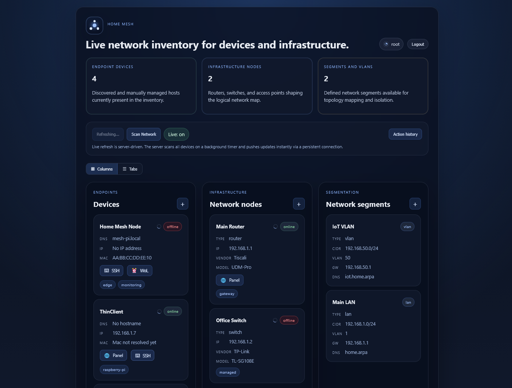

# Home Mesh



Home Mesh is a local-first network inventory and control panel for home labs and small networks.

It is designed to discover, map, and manage:

- endpoint devices
- network infrastructure such as routers, switches, and access points
- logical network segments such as LANs and VLANs
- operational actions such as Wake-on-LAN and SSH access

The goal is to provide a lightweight control surface that can manage heterogeneous devices and infrastructure, while being able to run on a thin client, Raspberry Pi, mini PC, or another always-on node near the network edge.

It is built for the awkward middle ground between "just SSH into it" and "deploy a full enterprise stack": a small, opinionated dashboard that can inventory your network, run a few useful actions, and stay close to the edge where the network actually lives.

The deployment model is intentionally portable. Docker is the easiest path, but the backend and frontend can also be run natively without assuming a Windows-only or PowerShell-only environment.

## What It Does

Current MVP capabilities include:

- support for heterogeneous managed targets, not just one class of device
- inventory CRUD for devices, network nodes, and network segments
- topology relations and a visual topology graph
- backend-driven live refresh for devices and network nodes
- SSE-based progressive UI updates pushed from the backend
- batch `nmap`-powered background scanning when available, with fallback probing logic
- DNS-to-IP refresh when a hostname is configured
- best-effort MAC address resolution
- manual MAC address entry for devices
- Wake-on-LAN for devices with a known MAC address
- encrypted per-device SSH credential storage
- interactive SSH terminal in the web UI
- action history for operational events
- application authentication with backend-protected APIs
- Docker-based local deployment

## Architecture

The project is split into two main parts:

- Go backend
  - REST API
  - SQLite persistence
  - background refresh and probing logic
  - SSE event stream for live updates
  - Wake-on-LAN
  - encrypted secrets
  - SSH execution and terminal sessions
- React + TypeScript frontend
  - inventory dashboard
  - topology graph
  - CRUD popups
  - server-driven live state updates
  - SSH modal and terminal UI

## Repository Structure

- `cmd/server`
  - backend entrypoint
- `internal/actions`
  - operational actions such as Wake-on-LAN
- `internal/api`
  - HTTP routing and API handlers
- `internal/config`
  - environment-based configuration
- `internal/monitor`
  - live refresh and reachability checks
- `internal/secrets`
  - encryption/decryption for stored secrets
- `internal/sshclient`
  - SSH command and terminal session logic
- `internal/store`
  - SQLite schema and persistence layer
- `web`
  - React + TypeScript frontend

## Tech Stack

- Go
- React
- TypeScript
- Vite
- SQLite
- Server-Sent Events (SSE)
- Docker Compose
- Nginx for frontend container serving/proxying

## Local Development

### Prerequisites

- Go 1.25+
- Node.js 24+
- npm 11+
- Docker Desktop or Docker Engine

### Environment

Create a local `.env` from `.env.example`.

Required values:

- `HOME_MESH_MASTER_KEY`
- `HOME_MESH_SESSION_SECRET` with at least 32 bytes
- `HOME_MESH_BOOTSTRAP_ADMIN_PASSWORD` with at least 12 bytes on first start
- optionally `HOME_MESH_SCAN_INTERVAL`
- optionally `HOME_MESH_SESSION_DURATION` between 5 minutes and 24 hours
- optionally `HOME_MESH_SSH_HOST_KEY_MODE`
- optionally `HOME_MESH_TRUSTED_PROXY_CIDRS` when running behind an explicit reverse proxy
- optionally `HOME_MESH_NMAP_PATH`
- optionally `HOME_MESH_DISCOVERY_ALLOW_PUBLIC` for an explicit, high-risk
  public-range scan opt-in
- optionally `HOME_MESH_SEED_DEMO_DATA=true` for a disposable, empty database
- optionally `HOME_MESH_WEB_PORT`

Example:

```dotenv
HOME_MESH_MASTER_KEY=replace-with-a-base64-encoded-32-byte-key
HOME_MESH_MASTER_KEY_VERSION=2
HOME_MESH_PREVIOUS_MASTER_KEYS=
HOME_MESH_SEED_DEMO_DATA=false
HOME_MESH_SESSION_SECRET=replace-with-a-long-random-session-secret
HOME_MESH_SESSION_DURATION=1h
HOME_MESH_AUTH_DISABLED=false
HOME_MESH_TRUSTED_PROXY_CIDRS=172.16.0.0/12
HOME_MESH_BOOTSTRAP_ADMIN_USERNAME=root
HOME_MESH_BOOTSTRAP_ADMIN_PASSWORD=replace-with-a-strong-password-for-first-start-only
HOME_MESH_SSH_HOST_KEY_MODE=known_hosts
HOME_MESH_NMAP_PATH=nmap
HOME_MESH_DISCOVERY_ALLOW_PUBLIC=false
HOME_MESH_SCAN_INTERVAL=30s
HOME_MESH_HTTP_ADDR=:8080
HOME_MESH_WEB_PORT=3000
```

To generate a local master key:

Unix-like shells:

```sh
openssl rand -base64 32
```

PowerShell:

```powershell
[Convert]::ToBase64String((1..32 | ForEach-Object { [byte](Get-Random -Maximum 256) }))
```

### Run Backend Natively

```sh
go run ./cmd/server
```

The backend listens on:

- `http://localhost:8080`

### Run Frontend Natively

```sh
cd web
npm install
npm run dev
```

The frontend dev server runs on:

- `http://localhost:5173`

The Vite dev server proxies `/api` to the backend, including SSE and SSH terminal websocket traffic.

### Build Checks

Backend:

```sh
go build ./cmd/server
```

Frontend:

```sh
cd web
npm run build
```

## Docker Compose

The project can also run via Docker Compose.

Current Docker layout:

- `api`
  - Go backend
  - configured with `network_mode: host`
  - this is useful for LAN operations such as Wake-on-LAN, ARP, and reachability checks
  - includes `nmap` in the container image for discovery and background scans
- `web`
  - frontend served by Nginx
  - proxies `/api` to the backend via `host.docker.internal:8080`
  - maps `host.docker.internal` through Docker's `host-gateway` on Linux
  - preserves the canonical Host header and forwards controlled client/protocol
    metadata required by SSH WebSockets, rate limiting, and origin checks

Start the stack:

```sh
docker compose up -d --build
```

Open:

- frontend: `http://localhost:3000`
- backend API: `http://localhost:8080`

Current Compose note:

- `HOME_MESH_WEB_PORT` controls the published frontend port.
- The backend listener is configured with `HOME_MESH_HTTP_ADDR` and should remain `:8080` unless the Nginx proxy target is changed as well.

Stop the stack:

```sh
docker compose down
```

## Configuration Notes

### SSH Secret Storage

SSH passwords are not stored in plaintext.

They are encrypted server-side using XChaCha20-Poly1305 and authenticated against
the owning device ID. Without `HOME_MESH_MASTER_KEY`, encrypted SSH credential
storage and SSH execution will not work. Startup validates all stored credentials
before accepting traffic, so a missing or incorrect key fails immediately.

To rotate the key, increment `HOME_MESH_MASTER_KEY_VERSION`, put the new key in
`HOME_MESH_MASTER_KEY`, and retain older keys in
`HOME_MESH_PREVIOUS_MASTER_KEYS` as comma-separated `version:base64` entries.
Previous versions must be lower than the current version. Readable legacy rows
are re-encrypted with the current key during startup; remove an old key only
after one successful start has completed that migration.

### Application Authentication

Home Mesh protects backend APIs with a single application-level login. Startup
fails closed when `HOME_MESH_SESSION_SECRET` is missing or shorter than 32 bytes.
An intentionally unauthenticated development runtime requires the explicit
`HOME_MESH_AUTH_DISABLED=true` opt-out; never use that mode on a shared network.

First-start bootstrap:

- set `HOME_MESH_BOOTSTRAP_ADMIN_USERNAME`
- set `HOME_MESH_BOOTSTRAP_ADMIN_PASSWORD`
- start the app once
- the backend stores only an `Argon2id` password hash in SQLite
- remove `HOME_MESH_BOOTSTRAP_ADMIN_PASSWORD` from `.env` after bootstrap if you do not want it lingering on disk

Behavior:

- unauthenticated requests to protected API routes return `401`
- the frontend shows a login form before loading the dashboard
- successful login creates an `HttpOnly` session cookie
- session lifetime defaults to 1 hour and is bounded by `HOME_MESH_SESSION_DURATION`
- logout revokes the current session server-side; process restarts revoke all sessions
- failed login attempts are rate-limited per client IP
- concurrent Argon2 password checks are bounded to cap authentication memory use

This protection applies server-side, so direct requests to the backend API are also blocked without a valid session.

`HOME_MESH_TRUSTED_PROXY_CIDRS` is a comma-separated allowlist of reverse-proxy
networks whose `X-Forwarded-For` and `X-Forwarded-Proto` headers may be trusted.
Loopback is always trusted. Compose defaults this value to the Docker bridge range
`172.16.0.0/12`; native deployments should leave it empty unless a known proxy is
in front of the API, and should use the narrowest CIDRs practical.

### SSH Host Key Mode

The secure default is `HOME_MESH_SSH_HOST_KEY_MODE=known_hosts`. Compose reads
host keys from `data/known_hosts`; populate that file with keys verified through
a trusted channel before opening an SSH session.

Native execution can override the default user known-hosts file with:

- `HOME_MESH_SSH_KNOWN_HOSTS_PATH`

Unverified SSH host keys are rejected; there is no insecure host-key mode.

### Database

SQLite data is stored in:

- `data/home-mesh.db`

That directory should be treated as local state, not source code.

Schema migrations, integrity checks, foreign-key checks, and file-permission
hardening run automatically when the store opens. Fresh databases start empty;
demo inventory is inserted only with `HOME_MESH_SEED_DEMO_DATA=true` and only
when every application table is empty.

### Discovery And Background Scanning

Home Mesh uses two closely related scan paths:

- manual discovery via:
  - `GET /api/discovery/capabilities`
  - `POST /api/discovery/scan`
- backend-scheduled refresh loops that update known devices and network nodes and push changes to the UI over SSE

Current shape:

- Docker Compose API image includes `nmap`
- native non-Docker runs require `nmap` to be installed separately if you want discovery or faster batch scans
- the backend falls back to legacy probing when `nmap` is unavailable
- the background scan interval is controlled by `HOME_MESH_SCAN_INTERVAL`

You can override the binary path with:

- `HOME_MESH_NMAP_PATH`

### Live Refresh

Live refresh is server-driven.

The backend runs a background scan loop, stores changes in SQLite, and publishes progressive updates over `/api/events`. The frontend subscribes once and updates the dashboard in place without browser polling.

## Deployment

There are two realistic deployment modes for Home Mesh.

### 1. Docker Compose on a Thin Client or Mini PC

This is the current recommended deployment path.

Best host targets for running Home Mesh itself:

- Linux thin client
- mini PC
- Raspberry Pi class edge node

Recommended steps:

1. clone the repository
2. create `.env`
3. set a real `HOME_MESH_MASTER_KEY`
4. run:

```bash
docker compose up -d --build
```

Why this works well:

- simple updates
- reproducible deployment
- persistent SQLite data on disk
- backend can run close to the network edge

Important note:

- for Wake-on-LAN, ARP, and LAN probing, Linux host networking is much more reliable than Docker Desktop on Windows

### 2. Native Backend + Static Frontend

This is a good future production shape for a very lightweight install.

Model:

- run the Go backend as a native service
- serve the built frontend with Nginx or directly from the backend later

This is especially attractive when:

- you want fewer moving parts
- you want better low-level LAN visibility
- you want a smaller operational footprint

## Contributing

Home Mesh is being prepared for a cleaner open-source workflow.

Working expectations for contributions:

- changes should land through pull requests
- `main` should stay mergeable and deployable
- backend and frontend changes should be validated before merge
- changes touching auth, proxying, SSH, discovery, or Docker should get especially careful review

## Known Current Limitations

- topology discovery is still mostly manual
- MAC address resolution is best-effort and depends on network visibility
- Wake-on-LAN reliability depends on deployment/network environment
- background scanning currently focuses on known devices and nodes, not full autonomous topology discovery
- floorplans and physical placement are not implemented yet
- authentication hardening exists, but proxy-trust and edge deployment behavior still deserve careful review
- router/switch-specific discovery integrations are not implemented yet

## Project Status

This repository is beyond bootstrap and already in early working-MVP territory.

Core foundations already in place:

- persistent inventory
- visual dashboard
- backend-driven live refresh
- progressive per-item live updates
- topology graph
- Wake-on-LAN
- SSH credentials and SSH terminal
- application authentication
- Docker deployment path
- basic open-source contribution guardrails

Next large product areas are likely to be:

- better topology/discovery
- stronger secrets and operations workflows
- authentication and hardening
- deployment refinement for edge devices
